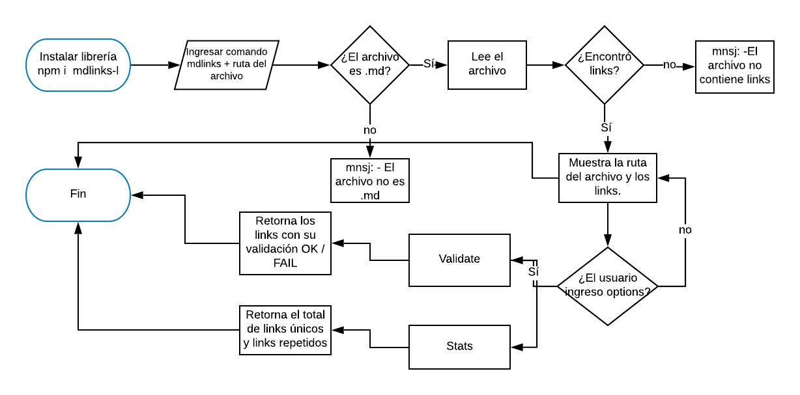

# MdLinks-l

Esta librería fue creada con la finalidad de leer y analizar tus archivos Markdown (.md). Identifica los links que contiene, tanto únicos como repetidos y los analiza para verificar el estado en el que se encuentran `OK / Broken` 

Es importante mantener tus archivos en constante revisión para ofrecerle a los lectores una mejor experiencia evitando que algún link se encuentre roto o repetido. 

## Comenzando  🚀

Para poder usar esta librería tendrás:

- Primero haber instalado node.js (npm install).
- Instala la librería con el comando `npm i mdlinks-l`.
- Abre tu terminal y ubícate en el archivo/carpeta que quieras analizar.
- Para ejecutar la librería debes escribir el comando `mdlinks` seguido de la ruta del `archivo con extensión .md`  y la opción de lo que quieres que realize la librería `--validate --stats`
 
Ejemplo: `mdlinks ./README.md --validate`

## Options
 
 La librería **mdlinks-l** cuenta con las siguientes opciones:

`--validate` : Esta opción devuelve un arreglo de links, te aparecerá una lista de los links con su ruta y su validación (OK/200 o FAIL/404).

`--stats` : Esta opción devuelve cuántos links encontró en total dentro del archivo .md, cuántos son únicos y repetidos.

**Nota:** Si no se ingresa una opción **mdlinks-l** devolverá un arreglo con los links encontrados en la ruta indicada. 

### Herramientas de construcción 🛠️

- Javascript ES6
- Node.js Modules:
  * fs (file system)
  * node-fetch
  * colors
- RegEx
- module.exports
- Jest (pruebas unitarias)

## Diagrama de flujo que se utilizó para crear esta librería
 

## Agradecimientos
A todas mis compañeras que me ayudaron en este proyecto con sus grandes ideas y sus mentes brillantes.

Paulina Zedillo gracias por ser mi Zen del código.

A todas las personas que me acompañaron en este proceso de aprendizaje.
Gracias.
